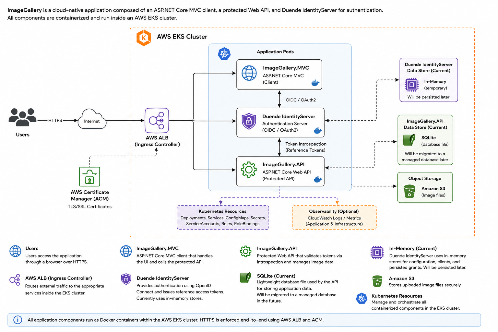

# ImageGallery-OIDC-Kubernetes

## Overview

ImageGallery is an ASP.NET Core application that allows authenticated users to browse, upload, and manage image content through a secure cloud-native platform.

Originally designed as a local ASP.NET Core security sample application, the project was expanded into a fully containerized multi-environment platform demonstrating OAuth2/OpenID Connect authentication, claims-based authorization, Docker containerization, Kubernetes deployment, AWS EKS hosting, HTTPS ingress with AWS ALB + ACM, and Infrastructure as Code using Terraform.

Supported deployment environments include:

- Local ASP.NET Core development
- Docker Compose deployment
- Local Kubernetes deployment
- AWS EKS cloud deployment

The platform demonstrates modern authentication and authorization patterns using Duende IdentityServer, including OpenID Connect login flows, OAuth2-protected APIs, reference token introspection, role-based authorization, and claims-based authorization policies.

## Features

### Authentication & Authorization

- Duende IdentityServer authentication provider
- OpenID Connect (OIDC) login flow
- OAuth2-protected APIs
- Reference token introspection
- Claims-based authorization
- Role-based authorization policies
- Custom resource-based authorization handlers
- Image ownership enforcement using custom authorization requirements

### Application Features

- ASP.NET Core MVC client application
- Protected ASP.NET Core Web API
- Secure image upload and management

### Deployment & Infrastructure

- Docker containerization
- Docker Compose orchestration
- Local Kubernetes deployment
- AWS EKS deployment
- AWS ALB ingress controller
- HTTPS with AWS Certificate Manager (ACM)
- Cloudflare DNS integration
- Terraform infrastructure provisioning
- Kubernetes ConfigMaps and Secrets

## Live Demo

The ImageGallery MVC client application is publicly hosted on AWS EKS and can be accessed here:

🔗 **Live Application:** https://imagegallery.boeninglabs.net/

> ⚠️ Note: The environment may occasionally be offline during infrastructure maintenance, redeployment, or cost optimization activities.

The MVC client communicates with protected backend API services secured using OAuth2 and OpenID Connect.

Authentication and token issuance are handled using Duende IdentityServer.

### Test Users

#### Emma

- Username: Emma
- Password: password

**Permissions**
- Can upload images
- Can edit/delete owned images
- Assigned `PayingUser` role
- Contains required authorization claims

#### David

- Username: David
- Password: password

**Permissions**
- Can browse images
- Demonstrates restricted authorization policies

## Architecture



The platform consists of an ASP.NET Core MVC client, a protected ASP.NET Core Web API, and a Duende IdentityServer authentication provider running as containerized workloads inside an AWS EKS cluster. Traffic is routed through an AWS Application Load Balancer (ALB) with HTTPS termination provided by AWS Certificate Manager (ACM).

## Authentication & Authorization

Authentication and authorization are implemented using Duende IdentityServer with OpenID Connect (OIDC) and OAuth2 flows.

The ASP.NET Core MVC client authenticates users through the Duende IdentityServer IDP using the Authorization Code Flow.

The protected API supports multiple OAuth2 token validation modes, configurable through environment-based settings:

- Reference tokens validated through OAuth2 introspection
- Self-contained JWT access tokens validated locally
- Local development JWTs using `dotnet user-jwts`

The platform defaults to OAuth2 reference tokens to demonstrate introspection-based validation patterns commonly used in distributed systems and microservices environments.

Authorization is enforced at multiple levels throughout the platform:

- Authenticated user requirements
- Role-based authorization
- Claims-based authorization
- OAuth2 scope-based authorization
- Resource ownership enforcement using custom authorization handlers

Example authorization scenarios include:

- Only authenticated users can access protected API endpoints
- Only users with the `PayingUser` role may upload images
- Upload permissions additionally require specific user claims
- Users may only modify or delete images they own
- APIs validate OAuth2 scopes before allowing write operations

The platform includes custom ASP.NET Core authorization handlers and requirements to demonstrate resource-based authorization patterns using token claims and route-based ownership validation.

## Deployment Modes

The platform supports multiple deployment environments to demonstrate the evolution from local ASP.NET Core development to fully containerized cloud-native deployment.

| Environment | Description |
|---|---|
| Local ASP.NET Core | Traditional multi-project local development |
| Docker Compose | Fully containerized local deployment |
| Local Kubernetes | Kubernetes deployment using Docker Desktop |
| AWS EKS | Cloud-native deployment on Amazon EKS using Terraform Infrastructure as Code |

## Local Development

The platform can be run locally using standard ASP.NET Core hosting without Docker or Kubernetes.

### Prerequisites

- .NET 8 SDK
- PowerShell
- ASP.NET Core HTTPS development certificates

### Environment Configuration

Local environment configuration templates are provided in:

```text
env/templates/local.template.env
```

Create a local development environment file:

```powershell
Copy-Item env/templates/local.template.env env/local.env
```

Replace placeholder values with local development settings before starting the platform.

The environment configuration includes:

- OIDC authority settings
- Client application configuration
- API configuration
- Database connection strings
- Token validation settings

### Starting The Platform

The repository includes a PowerShell orchestration script that automatically launches all platform services in the correct order.

Run:

```powershell
.\Start-All-ImageGalleryV2.ps1
```

The startup script performs the following tasks:

- Loads environment variables from `env/local.env`
- Starts the Duende IdentityServer IDP
- Waits for the IDP to become available
- Starts the ImageGallery API
- Waits for the API to become available
- Starts the MVC client application

Each service is launched in a separate PowerShell window to simplify local debugging and development.

### Local Service Endpoints

| Service | URL |
|---|---|
| MVC Client | https://localhost:7184 |
| ImageGallery API | https://localhost:7075 |
| Duende IdentityServer | https://localhost:5001 |

## Docker Deployment

The platform supports fully containerized local deployment using Docker Compose.

Containerized deployment includes:

- ASP.NET Core MVC client
- ASP.NET Core Web API
- Duende IdentityServer IDP
- NGINX reverse proxy for HTTPS/TLS termination

### Docker Architecture

The Docker environment simulates a production-style reverse proxy architecture where:

- NGINX handles HTTPS/TLS termination
- IdentityServer runs behind a reverse proxy using the `/idp` path base
- Containers communicate internally over a dedicated Docker network
- Browser traffic is routed through HTTPS endpoints exposed by NGINX

### Environment Configuration

Docker environment configuration templates are provided in:

```text
env/templates/docker.template.env
```

The template includes detailed documentation covering:

- Internal vs external container networking
- OIDC authority configuration
- Reverse proxy forwarding behavior
- HTTPS/TLS termination
- OAuth2 token introspection
- Docker container communication patterns

Create a local Docker environment file:

```powershell
Copy-Item env/templates/docker.template.env env/docker.env
```

Replace placeholder values with local development settings before starting the environment.

### Starting The Docker Environment

Run:

```powershell
docker compose up --build
```

### Docker Service Endpoints

| Service | URL |
|---|---|
| MVC Client (via NGINX) | https://localhost:5000 |
| Duende IdentityServer | https://localhost:5000/idp |
| ImageGallery API | https://localhost:7075 |

### Notes

- Docker Compose automatically provisions a dedicated Docker network for inter-container communication.
- NGINX is used to simulate ingress-style HTTPS routing before Kubernetes deployment.
- The Docker environment uses self-signed development certificates for HTTPS.
- Internal container communication intentionally uses HTTP within the isolated Docker network.
- The platform separates browser-facing URLs from internal container URLs to support OpenID Connect flows correctly inside Docker containers.

## Kubernetes Deployment

## AWS EKS Deployment

## Infrastructure

## Security Notes

## Screenshots

## Lessons Learned

- Linux containers and Kubernetes deployments are case-sensitive, which exposed path inconsistencies that worked on Windows development environments but failed inside Docker and Kubernetes.

## Future Improvements

## Author

Jonathan Boening

- GitHub: [boeningj](https://github.com/boeningj)
- LinkedIn: [Jonathan Boening](https://www.linkedin.com/in/jonathan-boening/)