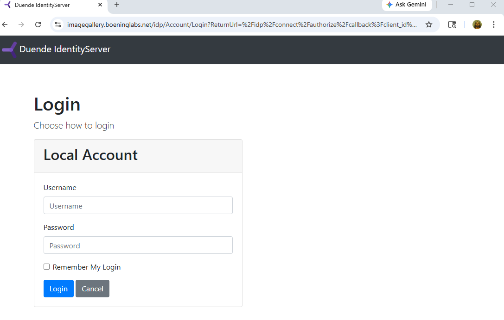
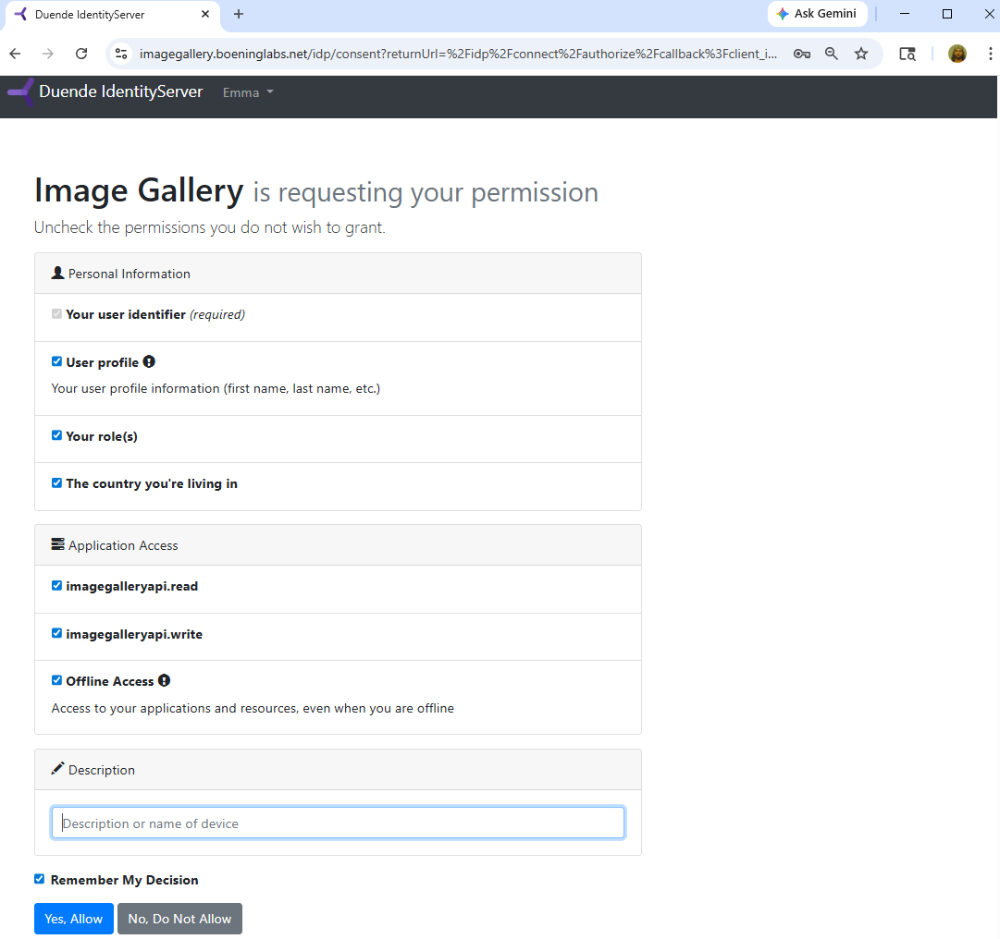
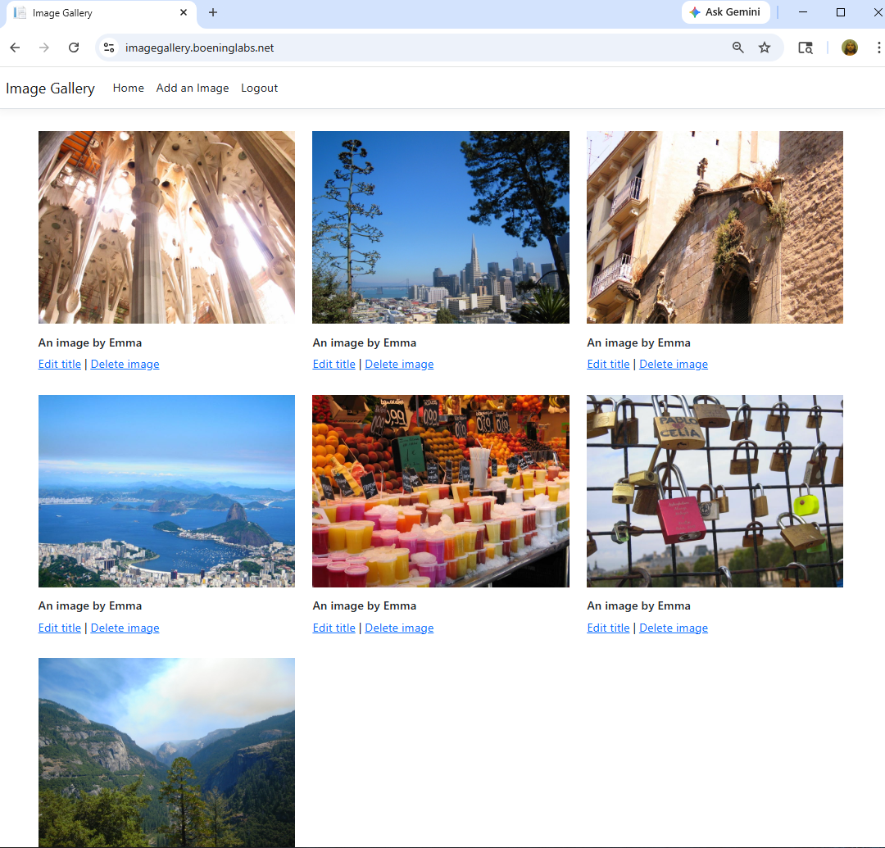
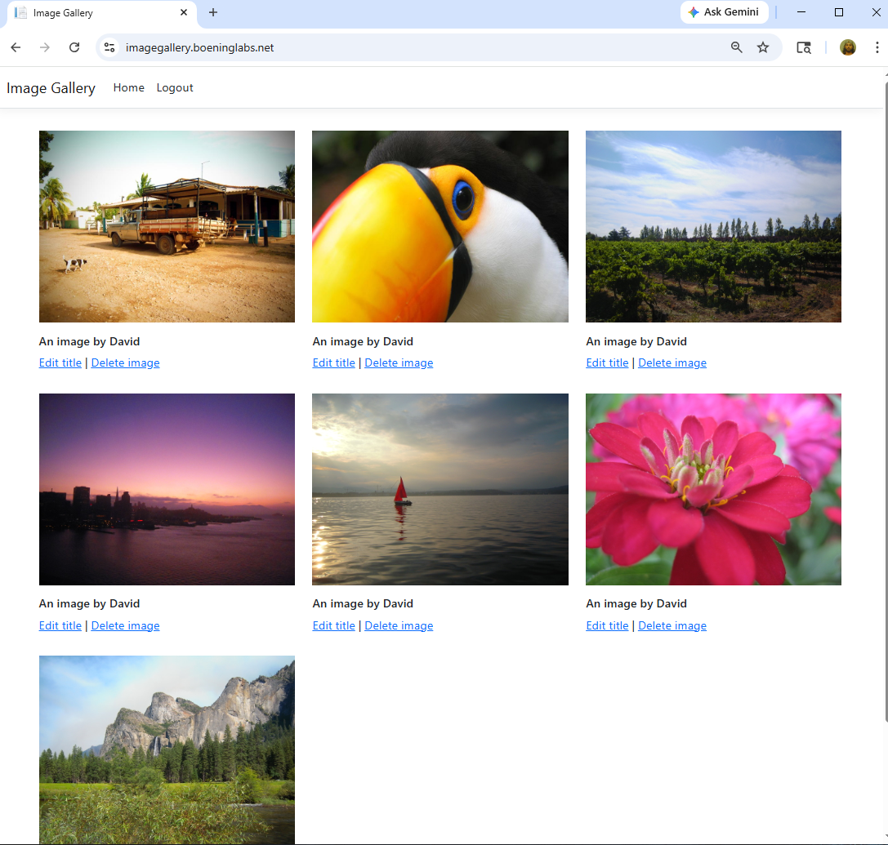

# ImageGallery-OIDC-Kubernetes

Cloud-native ASP.NET Core OAuth2/OIDC platform deployed with Kubernetes and AWS EKS.

## Overview

ImageGallery is a cloud-native ASP.NET Core platform demonstrating modern OAuth2/OpenID Connect authentication, containerization, Kubernetes orchestration, and AWS cloud deployment.

The platform consists of:
- An ASP.NET Core MVC client
- A protected ASP.NET Core Web API
- A Duende IdentityServer authentication provider

Supported deployment environments include:
- Local ASP.NET Core
- Docker Compose
- Local Kubernetes
- AWS EKS

## Tech Stack

- ASP.NET Core 8
- Duende IdentityServer
- OAuth2 / OpenID Connect
- Docker & Docker Compose
- Kubernetes
- AWS EKS
- Terraform
- NGINX
- AWS ALB + ACM
- Cloudflare DNS

## Key Features

### Security & Authentication

- OpenID Connect (OIDC) login flows
- OAuth2-protected APIs
- Reference token introspection
- Claims-based and role-based authorization
- Custom ASP.NET Core authorization handlers
- Resource ownership enforcement

### Cloud & Infrastructure

- Docker containerization
- Kubernetes orchestration
- AWS EKS deployment
- HTTPS ingress configuration
- Terraform Infrastructure as Code
- Kubernetes ConfigMaps and Secrets

### Application Features

- ASP.NET Core MVC client
- Protected ASP.NET Core Web API
- Secure image upload and management

## Live Demo

The ImageGallery MVC client application is publicly hosted on AWS EKS and can be accessed here:

🔗 **Live Application:** https://imagegallery.boeninglabs.net/

> ⚠️ Note: The environment may occasionally be offline during infrastructure maintenance, redeployment, or cost optimization activities.

### Test Users

#### Emma

- Username: Emma
- Password: password

**Permissions**
- Can upload images
- Can edit/delete owned images
- Assigned `PayingUser` role
- Contains required authorization claims

#### David

- Username: David
- Password: password

**Permissions**
- Can browse images
- Demonstrates restricted authorization policies

## Architecture

The following diagram illustrates the high-level architecture of the ImageGallery platform running on AWS EKS.


## Infrastructure

The repository is organized to support multiple deployment environments and infrastructure layers, ranging from local ASP.NET Core development to fully cloud-hosted Kubernetes workloads on AWS EKS.

### Repository Structure

```text
ImageGallery.API/
ImageGallery.Client/
ImageGallery.IDP/
ImageGallery.Authorization/

infra/terraform/aws/

k8s/local/
k8s/aws/

nginx/

env/templates/

docker-compose.yaml
```

| Path | Description |
|---|---|
| `ImageGallery.API/` | Secured ASP.NET Core Web API |
| `ImageGallery.Client/` | ASP.NET Core MVC client application |
| `ImageGallery.IDP/` | Duende IdentityServer OIDC/OAuth2 provider |
| `ImageGallery.Authorization/` | Shared authorization policies and requirements |
| `infra/terraform/aws/` | AWS Terraform Infrastructure as Code |
| `k8s/local/` | Local Kubernetes manifests |
| `k8s/aws/` | AWS EKS Kubernetes manifests |
| `nginx/` | Local reverse proxy configuration |
| `env/templates/` | Sanitized environment configuration templates |
| `docker-compose.yaml` | Docker Compose orchestration |

### Infrastructure Design Goals

The platform infrastructure was designed to demonstrate:

- Environment-specific deployment strategies
- Infrastructure as Code (IaC)
- Secure configuration management
- Cloud-native application hosting
- Kubernetes orchestration patterns
- HTTPS ingress and reverse proxy architecture
- Environment-driven application configuration

### Configuration Management

Configuration is separated by deployment environment using:

- Local environment files
- Docker environment files
- Kubernetes ConfigMaps & Secrets
- Terraform-managed infrastructure resources

Sanitized configuration templates are included to simplify onboarding and local development setup without exposing secrets.

## Authentication & Authorization

Authentication and authorization are implemented using Duende IdentityServer with OAuth2 and OpenID Connect (OIDC).

The platform demonstrates:
- Authorization Code Flow authentication
- OAuth2-protected APIs
- Claims-based and role-based authorization
- OAuth2 scope validation
- Reference token introspection
- Resource-based authorization using custom ASP.NET Core authorization handlers
- JWT access token validation (`at+jwt`)
- HTTPS/TLS ingress configuration
- Kubernetes Secret-based configuration management

The API supports both OAuth2 reference tokens and self-contained JWT access tokens through environment-based configuration.

## Deployment Modes

The platform supports multiple deployment environments to demonstrate the evolution from local ASP.NET Core development to fully containerized cloud-native deployment.

| Environment | Description |
|---|---|
| Local ASP.NET Core | Traditional multi-project local development |
| Docker Compose | Fully containerized local deployment |
| Local Kubernetes | Kubernetes deployment using Docker Desktop |
| AWS EKS | Cloud-native deployment on Amazon EKS using Terraform Infrastructure as Code |

## Local Development

The platform can be run locally using standard ASP.NET Core hosting without Docker or Kubernetes.

### Prerequisites

- .NET 8 SDK
- PowerShell
- ASP.NET Core HTTPS development certificates

### Environment Configuration

Local environment configuration templates are provided in:

```text
env/templates/local.template.env
```

Create a local development environment file:

```powershell
Copy-Item env/templates/local.template.env env/local.env
```

Replace placeholder values with local development settings before starting the platform.

### Starting The Platform

The repository includes a PowerShell orchestration script that automatically launches all platform services in the correct order.

Run:

```powershell
.\Start-All-ImageGalleryV2.ps1
```

The startup script performs the following tasks:

- Loads environment variables from `env/local.env`
- Starts the Duende IdentityServer IDP
- Waits for the IDP to become available
- Starts the ImageGallery API
- Waits for the API to become available
- Starts the MVC client application

Each service is launched in a separate PowerShell window to simplify local debugging and development.

### Local Service Endpoints

| Service | URL |
|---|---|
| MVC Client | https://localhost:7184 |
| ImageGallery API | https://localhost:7075 |
| Duende IdentityServer | https://localhost:5001 |

## Docker Deployment

The platform supports fully containerized local deployment using Docker Compose.

Containerized services include:

- ASP.NET Core MVC client
- ASP.NET Core Web API
- Duende IdentityServer IDP
- NGINX reverse proxy for HTTPS/TLS termination

### Starting The Docker Environment

Run:

```powershell
docker compose up --build
```

### Docker Service Endpoints

| Service | URL |
|---|---|
| MVC Client (via NGINX) | https://localhost:5000 |
| Duende IdentityServer | https://localhost:5000/idp |
| ImageGallery API | https://localhost:7075 |

Additional Docker architecture, networking, and environment configuration details are available in [`docs/docker.md`](docs/docker.md).

## Kubernetes Deployment

The platform supports Kubernetes-based deployment using Docker Desktop Kubernetes for local orchestration and testing.

The Kubernetes environment demonstrates:

- Container orchestration
- Service discovery
- Kubernetes ConfigMaps and Secrets
- Ingress-based routing
- HTTPS/TLS termination
- Multi-service workload deployment

### Local Kubernetes Deployment

Deploy the local environment:

```powershell
kubectl apply -f k8s/local/
```

Verify workloads:

```powershell
kubectl get pods -n imagegallery
```

Verify services:

```powershell
kubectl get svc -n imagegallery
```

Additional Kubernetes architecture, manifest organization, and configuration details are available in [`docs/kubernetes.md`](docs/kubernetes.md).

## AWS EKS Deployment

The platform is publicly hosted on Amazon Web Services (AWS) using Amazon Elastic Kubernetes Service (EKS).

The AWS deployment demonstrates a production-style cloud-native architecture including:

- Amazon EKS Kubernetes orchestration
- AWS Application Load Balancer (ALB) ingress
- HTTPS/TLS termination using AWS Certificate Manager (ACM)
- Public DNS routing using Cloudflare
- Infrastructure as Code using Terraform
- Kubernetes ConfigMaps and Secrets
- Containerized ASP.NET Core workloads

### AWS Traffic Flow Architecture

The following diagram illustrates the high-level public traffic flow for the AWS EKS deployment.


Additional AWS infrastructure, ingress, Terraform, and Kubernetes deployment details are available in [`docs/aws-eks.md`](docs/aws-eks.md).

## Screenshots

### OpenID Connect Login

Duende IdentityServer authentication flow used by the MVC client application.

<p align="center">
  
</p>

### OAuth2 Consent & Claims

Duende IdentityServer consent flow demonstrating OAuth2 scopes, claims-based identity information, and delegated API permissions.

<p align="center">
  
</p>

### Authorized User Experience (Emma)

Emma is assigned the `PayingUser` role and required authorization claims, allowing image upload and management operations.

<p align="center">
  
</p>

### Restricted Authorization Experience (David)

David can browse image content but does not satisfy the authorization requirements needed for image upload operations.

<p align="center">
  
</p>

## Lessons Learned

Building and deploying the platform across local development, Docker, Kubernetes, and AWS EKS environments exposed several real-world engineering and operational challenges.

Key lessons learned included:

- Linux containers and Kubernetes deployments are case-sensitive, which exposed path inconsistencies that worked on Windows development environments but failed inside Docker and Kubernetes.
- OAuth2/OIDC applications deployed behind reverse proxies require careful handling of external vs internal URLs, especially for redirect URIs and token validation endpoints.
- Docker container networking differs significantly from local host networking, requiring explicit handling of internal service discovery and hostname resolution.
- Kubernetes ingress and AWS ALB routing introduce additional complexity around HTTPS forwarding, path handling, and TLS termination behavior.
- OAuth2 reference tokens require runtime token introspection and introduce different operational considerations compared to self-contained JWT access tokens.
- Kubernetes ConfigMaps and Secrets greatly simplify environment-specific configuration management compared to local environment variable handling.
- IdentityServer signing key persistence becomes critical in containerized and distributed environments to prevent token validation failures during redeployments.
- Infrastructure as Code using Terraform improves repeatability and consistency for cloud infrastructure provisioning.
- Cloud-native deployments require stronger observability and troubleshooting practices compared to traditional local development workflows.
- Running applications successfully in Docker does not guarantee successful Kubernetes deployment due to differences in networking, ingress, configuration injection, and orchestration behavior.

## Future Improvements

Potential future enhancements for the platform include:

- Migrating the ImageGallery API from SQLite to a managed relational database platform such as SQL Server or Amazon RDS to support horizontal scaling and multi-replica deployments.
- Persisting Duende IdentityServer signing keys and operational data using durable shared storage instead of an in-memory configuration.
- Implementing centralized logging and observability using tools such as CloudWatch, Prometheus, or Grafana.
- Implementing automated container vulnerability scanning and image hardening practices.
- Implementing shared ASP.NET Core Data Protection key storage using Redis or another distributed provider to support reliable multi-replica deployments for the MVC client and IdentityServer workloads.
- Further automating cloud deployment workflows by integrating DNS management, ACM certificate provisioning, and Kubernetes workload deployment into Infrastructure as Code and CI/CD pipelines.
- Supporting horizontal pod autoscaling (HPA) for Kubernetes workloads.
- Implementing external secret management solutions such as AWS Secrets Manager or HashiCorp Vault.

## Author

Jonathan Boening

- GitHub: [boeningj](https://github.com/boeningj)
- LinkedIn: [Jonathan Boening](https://www.linkedin.com/in/jonathan-boening/)